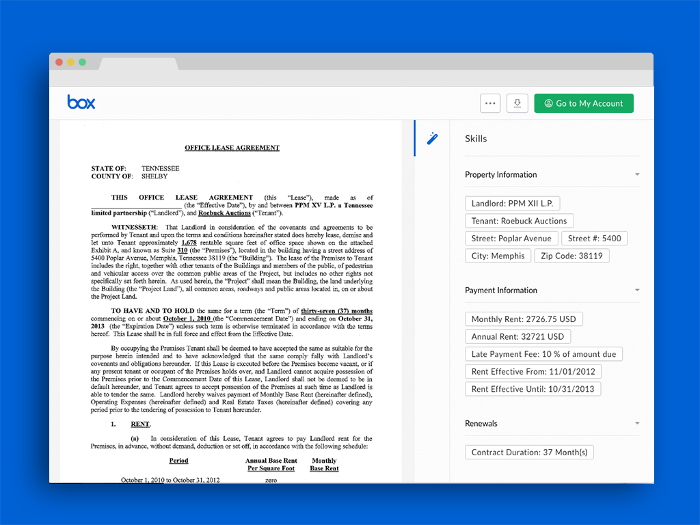

# Rental Lease Extraction with Leverton

This example uses the [Leverton](https://www.leverton.ai/) data extraction platform and the [Box Skills Kit](https://github.com/box/box-skills-kit-nodejs) to extract valuable information from rental lease agreements.



## Usage

### Prerequisites

* [Leverton](https://www.leverton.ai/) does not currently have a self-service API. You must reach out to Leverton and request a Leverton account / access to their API.
* Make sure to sign up for a [Box Developer](https://developer.box.com/) account and prepare your app for Box skills. See our [developer documentation](https://developer.box.com/docs/box-skills) for more guidance.

### Configuring Serverless

Our Box skills uses the excellent [Serverless framework](https://serverless.com/). This framework allows for deployment to various serverless platforms, but in this example we will use AWS as an example.

To use Serverless, install the NPM module.

```bash
npm install -g serverless
```

Next, follow our guide on [configuring Serverless for AWS](../AWS_CONFIGURATION.md), or any of the guides on [serverless.com](https://serverless.com/) to allow deploying to your favorite serverless provider.

### Deploying

Clone this repo and move into the Leverton folder.

```bash
git clone https://github.com/box-community/sample-document-skills
cd sample-document-skills/leverton-lease-extraction
```

Then update the environment variables `serverless.yml` with the appropriate IDs / keys from Leverton

```yaml
...

functions:
    leverton-custom-skill:
    ...
    environment:
      LEVERTON_AUTH_TOKEN: <your-leverton-auth-token>
      LEVERTON_PROJECT_ID: <your-project-id>
      DEFAULT_COLLECTION_ID: <your-default-collection-id>
```

Finally, deploy the Skill.

```bash
serverless deploy -v
```

At the end of this, you will have an invocation URL for your Lambda function. 

### Configuring your skill

The final step is to [configure your Box Skill with the invocation URL](https://developer.box.com/docs/configure-a-box-skill) for your Lambda function. You should have received this in the previous, after you deployed the function for the first time.

Once your new skill is called by our code, the Skill usually takes around two to five minutes to process and write the new metadata to the file.

## Frequently Asked Questions

### Who might use this Skill?

If you have ever manually identify information in a rental lease agreement, then this Skill is for you. This Skill turns a labourious process into an one that requires no human interaction.

### What types of files does this Skill handle?

This skill can handle `.pdf` files and images.

### What metadata is written back to my Box file?

The Leverton API supports many different types of information that can be extracted from your files, including the rental dates, owners, landlord names, adresses, tenant names, and more.

### What implications does this have for my business?
Using Box with Leverton has the potential to eliminate enormous ammounts of manual data entry using automated data capture that matches human levels of accuracy.

Additionally, the Box API can then kick off use case-specific workflows based on the returned metadata, like validating fraudulent applicants, flagging expired agreements, or adding retention policies based on dates.
