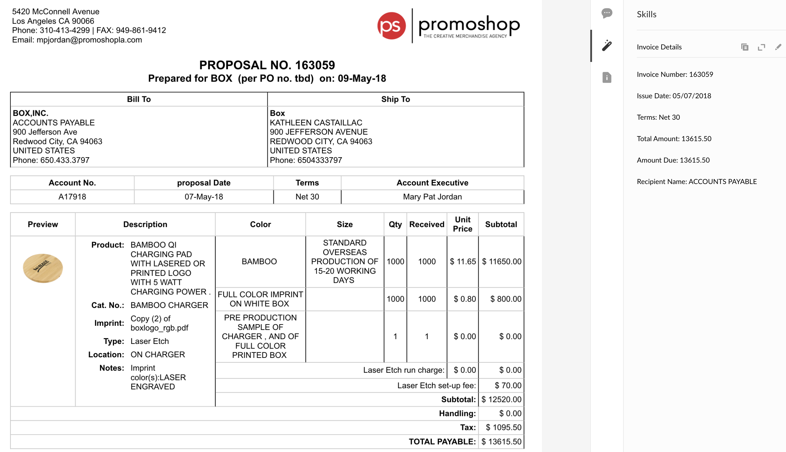

# Setup instructions

 1. Sign up for a [Rossum Developer](https://account.box.com/signup/n/developer#nql6m) account and obtain a Rossum secret key.

 2. Configure Serverless! 

 `npm install -g serverless` 

 Then in order to give Serverless access to your AWS account, you'll need to create a new IAM User with admin access. Here's how to do that:
  * Create or log in to your Amazon Web Services account
  * Go to the Identity & Access Management (IAM) page
  * Click on Users and then Add user.
  * Enter a name in the first field to remind you this User is Serverless, like serverless-admin.
  * Enable Programmatic access by clicking the checkbox.
  * Click Next to go through to the Permissions page.
  * Click on Attach existing policies directly.
  * Search for, and select AdministratorAccess then click Next: Review.
  * Check everything looks good and click Create user.
  * View and copy the API Key & Secret to a temporary place. You'll need it in the next step.

 3. Next, run:

 `serverless config credentials --provider aws --key YOURAPIKEY --secret YOURSECRET` 

 with the keys obtained from the last step above. Lastly, create your Serverless project!

 `serverless create --template aws-nodejs --path MySkillFunction`
 `cd MySkillFunction`

 4. Clone this repo in the serverless project you created in step 4, then fill in the environment variables in your serverless.yml file (the `ROSSUM_SECRET_KEY` from step 1).

 5. Deploy the app to AWS! 

 `serverless deploy -v`. 

 For subsequent edits, you can simply use `serverless deploy -v -f index`, which will quickly overwrite any changes you make to your function.

# Frequently Asked Questions

## What are Box Skills?
According to the official [Box Skills developer documentation](https://developer.box.com/docs/box-skills), a Box Skill is "a type of application that performs custom processing for files uploaded to Box." I couldn't have said it better myself. In this case, when an invoice or invoice-like document is uploaded to Box, we will send it to an ML service called Rossum.ai which extracts certain key information from the invoice.

## What is Rossum?
[Rossum](https://rossum.ai/developers) is an invoice data capture tool that specializes in extracting fields common to your typical invoice. The data returned from Rossum could include fields like amount, tax details, invoice ID, or sender and receiver name. The smart scientists at Rossum have trained a model such that these fields will be identified with consistently high degrees of accuracy.

## Who might use this Skill?
If you have ever manually entered any data from an invoice, then this Skill might be for you. And particularly if your invoices participate in any sort of workflow, with data in the invoice indicating where in your enterprise the document should end up and who should see it. All of this can now be automated.

## What types of files does the Skill handle?
You'll be able to upload either PDFs or images of invoices. With regard to images, Rossum requests that the quality be at least 150 dots per inch. 

## What metadata is written back to my Box file?
You'll be able to specify exactly which fields you care about writing as metadata to your file in Box. A complete list of fields returned by Rossum can be found at https://rossum.ai/developers/api/field_types.

Importantly, Rossum returns multiple results per field, each with a confidence score. In our skill we take only the highest score, so that we only end up with one sender name, one amount due, etc. that is most likely to be the field we actually care about.

The metadata is then posted as a Box Skills Transcript card. Some more info on Skills cards: https://developer.box.com/docs/box-skills.

## What far-reaching implications does this have for my business?
Using Box with Rossum has the potential to eliminate enormous ammounts of manual data entry using automated data capture that matches human levels of accuracy. But this is only half of story! The Box API then allows you to kick off all manner of tailored workflows based on the returned metadata. Copying and moving files, flagging unpaid invoices, adding retention policies based on dates: we can now bring heightened levels of automation to bear on all of these tasks.