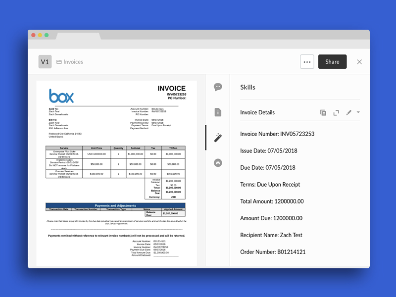

# Rossum Invoice Intelligence 

Use the [Rossum API](https://rossum.ai/developers) to automatically extract data from invoices and attach them to your files as metadata.

[Rossum](https://rossum.ai/) is an invoice data capture tool that specializes in extracting fields common to your typical invoice. The data returned from Rossum can include fields like amount, tax details, invoice ID, sender name and receiver name.



## Usage

### Prerequisites

* Make sure to sign up for a [Rossum Developer](https://rossum.ai/developers) account and obtain a Rossum API secret key.
* Make sure to sign up for a [Box Developer](https://developer.box.com/) account and prepare your app for Box skills. See our [developer documentation](https://developer.box.com/docs/box-skills) for more guidance. 

### Configuring Serverless

Our Box skills uses the excellent [Serverless framework](https://serverless.com/). This framework allows for deployment to various serverless platforms, but in this example we will use AWS as an example.

To use Serverless, install the NPM module.

```bash
npm install -g serverless
```

Next, follow our guide on [configuring Serverless for AWS](../AWS_CONFIGURATION.md), or any of the guides on [serverless.com](https://serverless.com/) to allow deploying to your favorite serverless provider.

### Deploying

Clone this repo and change into the Rossum folder.

```bash
git clone https://github.com/box-community/sample-document-skills
cd sample-document-skills/rossum-invoice-intelligence
```

Then change the `ROSSUM_SECRET_KEY` environment variable in your `serverless.yml` file to your Rossum API key.

```yaml
...

functions:
  index:
    ...
    environment:
      ROSSUM_SECRET_KEY: YOUR_ROSSUM_SECRET_KEY
```

Finally, deploy the Skill.

```bash
serverless deploy -v
```

At the end of this, you will have an invocation URL for your Lambda function. 

### Set the invocation URL

The final step is to [configure your Box Skill with the invocation URL](https://developer.box.com/docs/configure-a-box-skill) for your Lambda function. You should have received this in the previous, after you deployed the function for the first time.

Once your new skill is called by our code, the Skill usually takes around a few minutes to process and write the new metadata to the file.

## Frequently Asked Questions

### Who might use this Skill?
If you have ever manually entered any data from an invoice, then this Skill might be for you. And particularly if your invoices participate in any sort of workflow, with data in the invoice indicating where in your enterprise the document should end up and who should see it. All of this can now be automated.

### What types of files does this Skill handle?
This skill can both handle PDFs and images. With regard to images, Rossum requests that the quality be at least 150 dots per inch. 

### What metadata is written back to my Box file?
You'll be able to specify exactly which fields you care about writing as metadata to your file in Box. A complete list of fields returned by Rossum can be found in [Rossum's developer documentation](https://rossum.ai/developers/api/field_types).

Importantly, Rossum returns multiple results per field, each with a confidence score. In our skill we take only the highest score, so that we only end up with one sender name, one amount due, etc. that is most likely to be the field we actually care about.

The metadata is then posted as a Box Skills Transcript card. More information on [Box Skills metadata cards](https://developer.box.com/docs/box-skills) is available. 

### What implications does this have for my business?
Using Box with Rossum has the potential to eliminate enormous ammounts of manual data entry using automated data capture that matches human levels of accuracy.

Additionally, the Box API can then kick off specific tailored workflows based on the returned metadata, like copying and moving files, flagging unpaid invoices, or adding retention policies based on dates. 
